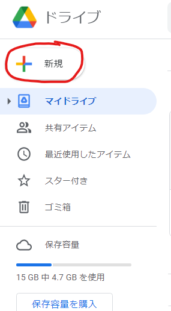

# Auto-ScreenShot-Kun
画面内の画像の変化を検知し、自動でスクリーンショットを撮影してくれるソフトです。
# 目次
[基本的な使い方](#基本的な使い方)

[撮影した画像を文字起こしする](#撮影した画像を文字起こしする)

[セットアップ](#セットアップ)

[使い方](#使い方)

[参考にしたサイト](#参考にしたサイト)

[Licence](#Licence)

## 基本的な使い方

1.[このページ](https://github.com/sakastudio/Auto-ScreenShot-Kun/releases/tag/1.0) からzipファイルをダウンロードしてください。

2.ダウンロードしたzipファイルを右クリックし、展開してください。

3.画面上に授業動画やzoomの画面を用意してください。今回はサンプルとして[こちら](https://www.youtube.com/watch?v=J9H2b5IqPHc) の動画をお借りします。

4.auto-screenshot-kun.exeを起動してください。

5.「WindowsによってPCが保護されました。」と出る場合は、「詳細情報」をクリックし、実行を押してください。

6.画面上のどの範囲のスクリーンショットを撮るかをドラッグで選択してください。

7.範囲設定が出来たら「はい」を押してください。

8.スクリーンショットの保存先フォルダを選択してください。

9.「スクショスタート」を押すと自動スクリーンショットが開始されます。範囲内の画像の変化を検知し、変化が起こったら画像を保存します。

10.「スクショを撮る」を押すと、その場でスクリーンショットを撮影します。変化が起こったけどスクリーンショットが撮影されなかった等、手動で撮影したいときに使用します。

## 撮影した画像を文字起こしする
撮影した大量のスライドを文字起こしし、Googleドキュメントにまとめます。
### セットアップ
1.[GoogleDrive](https://drive.google.com/drive/u/0/my-drive) を開き、新規>その他>Google Apps Scriptを選択してください。

3.「無題のプロジェクト」をクリックして、名前を変更してください。

4.[こちら](https://gist.github.com/sakastudio/e3c8de62716010bd6153df360ecd80f7) のソースコードをコピペして貼り付けてください。

5.DriveAPIを有効化します。サービスを押し、少し下にスクロールしたところにあるDrive APIを選択し、追加を押してください。

7.新規>フォルダを押してください。フォルダ名を「OCR」にして作成を押してください。

8.rootフォルダにある「OCRくん」をOCRフォルダに入れてください。

以上でセットアップは終了となります。

### 使い方

1.撮影した画像をアップロードします。Shiftキーを押してアップロードする画像を複数選択し、GoogleドライブのOCRフォルダにドラッグ＆ドロップしてください。

2.OCRくんをクリックしてください。

3.実行を押してください。

4.初回の実行の際には権限が求められますので、許可をします。

5.実行ログに実行完了が表示されれば正常に処理が終了しています。

## 参考にしたサイト
[画像差分](https://qiita.com/kikuyan8540/items/0c92a8ab47e84ec79652)
[スクリーンショット](https://qiita.com/hisakichi95/items/47f6d37e6f425f29c8a8)
[OCR](http://www.initialsite.com/w01/14488)

## Licence
[MIT](https://github.com/sakastudio/Auto-ScreenShot-Kun/blob/master/LICENSE)
